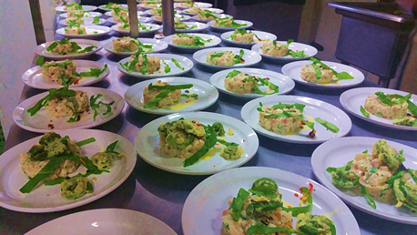

Avec sa mission de développements des compétences et des talents, *Portaxion* veut alimenter le mouvement de la nouvelle économie « verte ». Une véritable transition post-moderne est en cours et les opportunités sont nombreuses pour les personnes désireuses de revoir nos façons de produire et de consommer.

En combinant nos ressources, nous pouvons permettre à un plus grand nombre de réaliser leurs objectifs de bien-être, de développement et d’accomplissement personnel; nous pouvons simultanément travailler à l’avancement individuel et collectif. *Portaxion* veut activer les moyens disponibles pour réaliser ensemble nos aspirations, tout en demeurant les intendants du monde naturel menacé.

*Portaxion* a déjà posé les bases de trois projets en démarrage. Si ces projets vous interpellent, c’est peut-être l’occasion de songer à conjuguer vos forces avec nous. Jetez un coup d’œil sur les domaines qui sont proposés

Projet 1 : Lieu de rencontre et d’échange (possibilité de restauration et commerce au détail)

Projet 2 : Rendez-vous culinaire annuel

Projet 3 : Artisanat pour aînés(es)

Pour en apprendre davantage sur ces opportunités déjà en cours de développement, contactez-nous avec le type de partenariat qui pourrait vous intéresser : co-fondateur(trice), partenaire minoritaire, actionnaire, investisseur, employé(e)...

<Formulaire> (this is a link to the form called "L’entrepreneuriat en action - démonstration d’intérêt)
