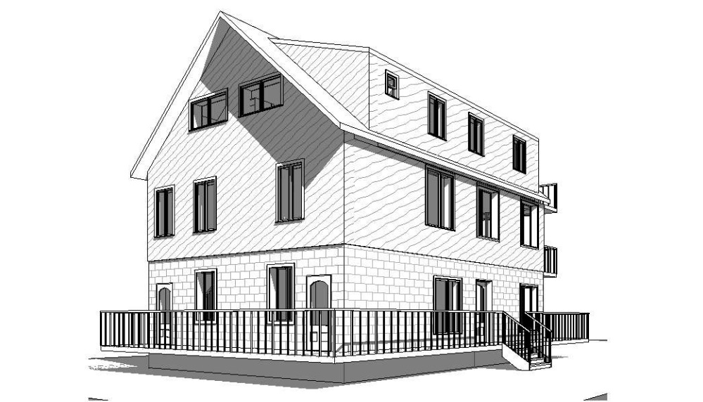

<!-- Main -->

<!-- One -->
<section id="one">
	

		<header class="major">
			<h2>Vous êtes conviés à prendre une part active à l'étape de conception!</h2>
		</header>
		
Bienvenue et merci de consulter la page de la <a href="{{ site.url }}/assets/FormulaireOuidansmacourFinal.pdf">candidature</a> de Portaxion au concours " <a href="https://www.ouidansmacour.quebec/">Oui dans ma cour</a> " de Vivre en ville. Fondée en 2017 pour promouvoir le développement des compétences en environnement et offrir des services de gestion de projets de construction écologique, Portaxion est fière de proposer un concept de " maison du développement durable " pour Gatineau. Au terme de votre visite, communiquez avec nous pour élaborer les conditions gagnantes de votre participation en tant que partie prenante au processus de conception intégré <a href="http://www.rncan.gc.ca/energie/efficacite/batiments/processus-conception-integree/4048">(rncan.gc.ca)</a>.

		
Inspirée par La Maison du développement durable <a href="https://lamdd.org">(lamdd.org)</a> et par La Maison productive <a href="https://vivreenville.org/media/543658/venv_densificationverte_ficheE1.pdf">(produktif.com)</a> toutes deux de Montréal, LA MAISON DURABLE DE GATINEAU a pour objectif de réunir en un même lieu, étudiants, professionnels, acteurs, décideurs et intéressés(es) du développement durable et de la lutte aux changements climatiques. Le projet s'inspire également, pour ses fonctions résidentielles, de la Maison Edelweiss <a href="http://www.ecohabitation.com/actualite/nouvelles/edelweiss-maison-confortable-abordable-consomme-quatre-moins-energie-maison-queb">(ecohabitation.com)</a> de Wakefield, Québec, qui vient récemment de confirmer, par son application locale réussie des critères les plus exigeants (certification LEED Platine), la présence de compétences de haut niveau en la matière, ici même en Outaouais.

		
La propriété du projet " Maison durable de Gatineau " profite d'une situation géographique enviable, près du centre-ville, des grands axes de de mobilité durable et de transport en commun; elle a déjà fait l'objet de rénovations et d'études pour en réduire son empreinte écologique. Sous l'égide du programme " Oui dans ma cour ", le projet poursuivra une dizaine d'objectifs qui visent ensemble à faire naître et prospérer un pôle d'expertise, offrant aux citoyens un exemple de lutte concertée face aux changements climatiques au Québec. En tant que " partie prenante " vous aiderez à préciser ces objectifs, à en ajouter au besoin, pour assurer que votre participation satisfasse aussi vos attentes.

	

</section>

<!-- Two -->
<section id="two" class="spotlights">
	<section>
		
		

			

				<header class="major">
					<h3>Objectif 1 : DENSIFICATION</h3>
				</header>
				
Le projet veut mettre en valeur une propriété du centre-ville de Hull qui se distingue par son emplacement de choix ainsi que par son bâtiment ancien (1888) à préserver au cœur du village urbain appelé "Quartier des maisons allumettes".

<!-- 				<ul class="actions">
					<li><a href="generic.html" class="button">Learn more</a></li>
				</ul> -->
			

		

	</section>
	<section>
		
		

			

<!-- 				<header class="major">
					<h3>Objectif 2 : MIXITÉ</h3>
				</header> -->
				
Le terrain fait environ 360 mètres carrés (3880 pi.ca.). Le bâtiment occupe 25% de la surface (et la partie ancestrale représente environ 40% du bâtiment). L'objectif du projet est de densifier cette propriété où se trouvent présentement 2 logements (duplex) en amenant le nombre final d'unités à 6.

<!-- 				<ul class="actions">
					<li><a href="generic.html" class="button">Learn more</a></li>
				</ul> -->
			

		

	</section>
	<section>
		
		

			

				<header class="major">
					<h3>Objectif 2 : MIXITÉ</h3>
				</header>
				
Le projet vise à réunir 3 fonctions : résidentielle (3) commerciale (1), et bureau (2). Une mixité est déjà présente à proximité immédiate avec une clinique médicale en face, de même qu'un stationnement municipal.  Le projet s'insère également dans une trame en profonde transformation. L'axe culturel Montcalm est à 50m à l'ouest et connait d'importants développement; le nouveau pôle Morin pour <a href="http://www.gatineau.ca/portail/default.aspx?p=la_ville/salle_medias/communiques/communique_2015&id=1465240810">ateliers d'artistes</a> commence à 50m au sud.

<!-- 				<ul class="actions">
					<li><a href="generic.html" class="button">Learn more</a></li>
				</ul> -->
			

		

	</section>
	<section>
		
		

			

				<header class="major">
					<h3>MIXITÉ (suite)</h3>
				</header>
				
LLe projet mets de l'avant des unités locatives de petite taille : Trois unités de logement sont proposées, dont 2 nouveaux studios en mansarde. La plus grande unité (logement existant) offre aussi trois chambres à louer. Deux bureaux à aire ouverte (de 350 pi.ca chacun, un par étage) font face au sud. Une salle de conférence est prévue au demi sous-sol. Un café occupe le rez-de-chaussée face à la rue Morin et le reste du sous-sol.

				
La mise en commun de certaines ressources (salles, équipements, vélos, autos) devrait mettre de réduire encore davantage l'empreinte écologiques des occupants.

<!-- 				<ul class="actions">
					<li><a href="generic.html" class="button">Learn more</a></li>
				</ul> -->
			

		

	</section>
	<section>
		
		

			

				<header class="major">
					<h3>Objectif 3 : DURABILITÉ</h3>
				</header>
				
Avec ses quatres unités supplémentaires, le projet se qualifie pour la <a href="http://www.gatineau.ca/portail/default.aspx?p=guichet_municipal/subventions_commandites/bonis_logements_ecologiques_leed&mc=s&q=LEED">subvention municipale</a> aux projets L.E.E.D.

				
Le projet vise la certification LEED " OR ", notamment par ses stratégies entourant l'économie d'énergie, la mobilité durable, les matériaux écologiques et locaux, ainsi que la gestion de l'eau de pluie et des matières résiduelles. Un minimum de 40% de la propriété demeurera dans son état naturel (jardin).  Voir aussi ci-dessous " Objectif 5 : Net-Zéro ".

<!-- 				<ul class="actions">
					<li><a href="generic.html" class="button">Learn more</a></li>
				</ul> -->
			

		

	</section>
	<section>
		
		

			

				<header class="major">
					<h3>Objectif 4 : LEADERSHIP EN ENVIRONNEMENT</h3>
				</header>
				
Le projet veut concrétiser une vision à jour, urbaine et engagée face aux changements climatiques. Comme la Maison du développement durable de Montréal, le projet entend réunir sous un même toit plusieurs acteurs locaux porteurs de cette importante mission environnementale. En plus de doter Gatineau d'un projet-phare qui démontre les meilleures pratiques en construction écologique, il agira pour rassembler, motiver et articuler pendant les solutions individuelles et collectives adaptées pour contrer le réchauffement.

				
La présence à Ottawa du Conseil du bâtiment durable du Canada (l'organisme qui administre  la norme LEED) est un atout important. Il en va ainsi pour les universités et autres institutions ottaviennes qui font preuve de leadership en environnement.

<!-- 				<ul class="actions">
					<li><a href="generic.html" class="button">Learn more</a></li>
				</ul> -->
			

		

	</section>
	<section>
		
		

			

				<header class="major">
					<h3>Objectif 5 : NET-ZÉRO</h3>
				</header>
				
En cette étape de conception, qui vise notamment à repousser les limites du design écologique, les parties prenantes voudront s'attarder au bilan carbone du projet complété. Voir par exemple la Maison Edelweiss et le Logement haute performance de TeamMtl. <a href="http://teammtl.ca/dpd-copy.html">(teammtl.ca)</a> Quelles approches et quelles technologies offrent les meilleurs rendement? La maison passive? La géothermie? Le gaz naturel? La production et le stockage in situ d'électricité  (panneaux photo-voltaïques, pile à combustion, batteries) contribueraient à diminuer les G.E.S., les coûts d'opérations et pourraient immuniser contre les augmentations de coûts futures. Les solutions retenues réduiront le phénomène " îlot de chaleur ", augmenteront la résilience du bâtiment et de ses fonctions et feront partie d'une analyse de la continuité d'affaires (voir Objectif 7 : Résilience et continuité).

<!-- 				<ul class="actions">
					<li><a href="generic.html" class="button">Learn more</a></li>
				</ul> -->
			

		

	</section>
	<section>
		
		

			

				<header class="major">
					<h3>Objectif 6 : MOBILITÉ DURABLE</h3>
				</header>
				
Le projet entend contribuer à faire de Gatineau  une ville exemplaire en transport durable : bornes de recharge pour véhicules électriques, installations pour cyclistes, accessibilité universelle. Les consignes LEED et la situation géographique du projet favoriseront les déplacements durables et diminueront l'empreinte carbone des visiteurs et occupants.

<!-- 				<ul class="actions">
					<li><a href="generic.html" class="button">Learn more</a></li>
				</ul> -->
			

		

	</section>
	<section>
		
		

			

				<header class="major">
					<h3>Objectif 7 : RÉSILIENCE ET CONTINUITÉ</h3>
				</header>
				
La conception d'un nouveau projet offre l'occasion de mettre en place les mesures de mitigation liées non seulement aux risques qui découlent des changements climatiques, mais à l'ensemble des risques qui peuvent compromettre les fonctions de l'infrastructure (bâtiment/activités) qui est proposée : systèmes électrique, de chauffage, informatique, de protection incendie, domotique, etc.

<!-- 				<ul class="actions">
					<li><a href="generic.html" class="button">Learn more</a></li>
				</ul> -->
			

		

	</section>
	<section>
		
		

			

				<header class="major">
					<h3>Objectif 8 : COMMUNAUTÉ ET CULTURE</h3>
				</header>
				
Le décision d'inclure un café au premier étage (nouvelle porte rue Morin) ajoute un degré de complexité au projet et aux approbations qui devront être obtenues. Toutefois, ce nouvel espace de rencontre aurait un rôle allant bien au-delà d'un simple facteur de rentabilité. En tant qu'élément structurant d'un quartier en effervescence et en développement, le café devient un carrefour de science, nature et culture. Non seulement viendrait-il  desservir les gens du milieu, mais il illustrerait nécessairement les meilleures pratiques du développement durable : matériaux locaux, produits locaux et biologiques, gestion intégrée des matières résiduelles, etc.

<!-- 				<ul class="actions">
					<li><a href="generic.html" class="button">Learn more</a></li>
				</ul> -->
			

		

	</section>
	<section>
		
		

			

				<header class="major">
					<h3>Objectif 9 : PRÉSERVATION PATRIMONIALE</h3>
				</header>
				
Le projet est conçu pour mettre en valeur une propriété du centre-ville de Hull qui se distingue par son bâtiment ancien à préserver au coeur du village urbain appelé "Quartier des maisons allumettes". Plusieurs altérations et annexes sont venues la modifier, mais la maison d'origine date de 1888; l'immeuble est répertoriée dans la "Liste des édifices d'intérêt patrimonial", annexe 6 de <a href="http://www.gatineau.ca/docs/guichet_municipal/subventions_commandites/mise_valeur_patrimoine_bati/inventaire_2008.fr-CA.pdf">"l'Inventaire et classement du patrimoine bâti de Gatineau"</a> (2011).

<!-- 				<ul class="actions">
					<li><a href="generic.html" class="button">Learn more</a></li>
				</ul> -->
			

		

	</section>
	<section>
		
		

			

				<header class="major">
					<h3>Objectif 10 : DÉMONSTRATION</h3>
				</header>
				
Le projet de Maison durable de Gatineau n'est pas assuré de voir le jour dans la forme qui sera recommandée par les parties prenantes dans le Rapport d'étude de faisabilité.  Le pari que font les participants est de repousser leurs propres idées et préjugés quant à ce qui peut et doit se faire dans la lutte aux changements climatiques. Au contact des meilleures ressources de la région en la matière, toutes devraient y trouver leur compte. Le travail ne saurait, par ailleurs, s'exécuter en vase clos. Il est à souhaiter que le projet  suscite un certain intérêt dans la population et favorise une discussion saine sur qui constitue une utilisation optimale du sol en zone urbaine.

<!-- 				<ul class="actions">
					<li><a href="generic.html" class="button">Learn more</a></li>
				</ul> -->
			

		

	</section>
</section>
<!-- Three -->
<section id="three">
	

		<header class="major">
			<h2>AUTRES RÉFÉRENCES</h2>
		</header>
		<ul>
			<li>CONSEIL DU BÂTIMENT DURABLE DU CANADA</li>
			<li>MAISON DU DÉVELOPPEMENT DURABLE</li>
			<li>MAISON PRODUCTIVE</li>
			<li>http://www.ecohabitation.com/actualite/nouvelles/maison-productive-house-mph-ecosysteme-quartier-pointe-st-charles</li>
			<li>http://www.produktif.com/project/sketch-of-maison-productive-house-mph/</li>
			<li>LOGEMENT HAUTE PERFORMANCE</li>
			<li>http://teammtl.ca/dpd-copy.html</li>
		</ul>
		<dl>
			<dt>OUTRO</dt>
			<dd>
				
Par ses objectifs de densification, de protection du patrimoine et de l'environnement, le projet "Maison durable de Gatineau"  permettra de dynamiser un quartier en pleine revitalisation. Reproduisant des solutions habituellement réservées aux écoquartiers - densité, mixité, durabilité, résilience - la MDDG propose, dans un bâtiment à échelle humaine, une application concréte des dernières avancées dans le domaine de l'écoconstruction. En participant au processus de conception intégrée, orienté et surpervisé par les professionnels de Vivre en Ville, les parties prenantes profiterons d'un contexte idéal pour questionner les modes traditionnel d'occupation du sol et contribuer à faire la lumière sur ce que pourrait être la réponse, à Gatineau, aux impératifs de la lutte aux changement climatiques. Et où ça? Oui, dans ma cour!

			</dd>
		</dl>
		<!-- <ul class="actions">
			<li><a href="generic.html" class="button next">Get Started</a></li>
		</ul> -->
	

</section>

